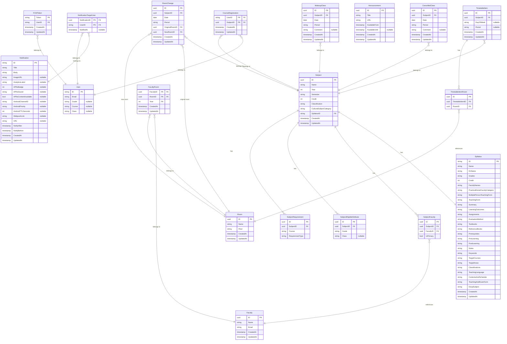

# ER図

`internal/shared/model` 配下のモデルのER図です。

```mermaid
erDiagram
    User {
        string ID PK
        string Email
        string Grade "nullable"
        string Course "nullable"
        string Class "nullable"
    }

    Faculty {
        uuid ID PK
        string Name
        string Email
        timestamp CreatedAt
        timestamp UpdatedAt
    }

    Room {
        uuid ID PK
        string Name
        string Floor
        timestamp CreatedAt
        timestamp UpdatedAt
    }

    Syllabus {
        string ID PK
        string Name
        string EnName
        string Grades
        int Credit
        string FacultyNames
        string PracticalHomeFacultyCategory
        string MultiplePersonTeachingForm
        string TeachingForm
        string Summary
        string LearningOutcomes
        string Assignments
        string EvaluationMethod
        string Textbooks
        string ReferenceBooks
        string Prerequisites
        string PreLearning
        string PostLearning
        string Notes
        string Keywords
        string TargetCourses
        string TargetAreas
        string Classifications
        string TeachingLanguage
        string ContentsAndSchedule
        string TeachingAndExamForm
        string DsopSubject
        timestamp CreatedAt
        timestamp UpdatedAt
    }

    Subject {
        uuid ID PK
        string Name
        int Year
        string Semester
        int Credit
        string Classification
        string CulturalSubjectCategory
        string SyllabusID FK
        timestamp CreatedAt
        timestamp UpdatedAt
    }

    SubjectFaculty {
        uuid ID PK
        uuid SubjectID FK
        uuid FacultyID FK
        bool IsPrimary
    }

    SubjectEligibleAttribute {
        uuid ID PK
        uuid SubjectID FK
        string Grade
        string Class "nullable"
    }

    SubjectRequirement {
        uuid ID PK
        uuid SubjectID FK
        string Course
        string RequirementType
    }

    TimetableItem {
        uuid ID PK
        uuid SubjectID FK
        string DayOfWeek "nullable"
        string Period "nullable"
        timestamp CreatedAt
        timestamp UpdatedAt
    }

    TimetableItemRoom {
        uuid ID PK
        uuid TimetableItemID FK
        uuid RoomID FK
    }

    CourseRegistration {
        string UserID PK "FK"
        uuid SubjectID PK "FK"
        timestamp CreatedAt
        timestamp UpdatedAt
    }

    FacultyRoom {
        uuid FacultyID PK "FK"
        uuid RoomID PK "FK"
        int Year PK
        timestamp CreatedAt
        timestamp UpdatedAt
    }

    RoomChange {
        uuid ID PK
        uuid SubjectID FK
        date Date
        string Period
        uuid OriginalRoomID FK
        uuid NewRoomID FK
        timestamp CreatedAt
        timestamp UpdatedAt
    }

    CancelledClass {
        uuid ID PK
        uuid SubjectID FK
        date Date
        string Period
        string Comment "nullable"
        timestamp CreatedAt
        timestamp UpdatedAt
    }

    MakeupClass {
        uuid ID PK
        uuid SubjectID FK
        date Date
        string Period
        string Comment "nullable"
        timestamp CreatedAt
        timestamp UpdatedAt
    }

    Announcement {
        uuid ID PK
        string Title
        string URL
        timestamp AvailableFrom
        timestamp AvailableUntil "nullable"
        timestamp CreatedAt
        timestamp UpdatedAt
    }

    Notification {
        string ID PK
        string Title
        string Body
        string ImageURL "nullable"
        string AnalyticsLabel "nullable"
        int APNsBadge "nullable"
        string APNsSound "nullable"
        bool APNsContentAvailable "nullable"
        string AndroidChannelID "nullable"
        string AndroidPriority "nullable"
        int AndroidTTLSeconds "nullable"
        string WebpushLink "nullable"
        string URL "nullable"
        timestamp NotifyAfter
        timestamp NotifyBefore
        timestamp CreatedAt
        timestamp UpdatedAt
    }

    NotificationTargetUser {
        uuid NotificationID PK "FK"
        string UserID PK "FK"
        timestamp NotifiedAt "nullable"
    }

    FCMToken {
        string Token PK
        string UserID FK
        timestamp CreatedAt
        timestamp UpdatedAt
    }

    Subject ||--|| Syllabus : "has"
    Subject ||--o{ SubjectFaculty : "has"
    Subject ||--o{ SubjectEligibleAttribute : "has"
    Subject ||--o{ SubjectRequirement : "has"
    SubjectFaculty }o--|| Faculty : "references"
    TimetableItem }o--|| Subject : "belongs to"
    TimetableItem ||--o{ TimetableItemRoom : "has"
    TimetableItemRoom }o--|| Room : "references"
    CourseRegistration }o--|| User : "belongs to"
    CourseRegistration }o--|| Subject : "belongs to"
    FacultyRoom }o--|| Faculty : "belongs to"
    FacultyRoom }o--|| Room : "belongs to"
    RoomChange }o--|| Subject : "belongs to"
    RoomChange }o--|| Room : "original room"
    RoomChange }o--|| Room : "new room"
    CancelledClass }o--|| Subject : "belongs to"
    MakeupClass }o--|| Subject : "belongs to"
    NotificationTargetUser }o--|| Notification : "belongs to"
    NotificationTargetUser }o--|| User : "belongs to"
    FCMToken }o--|| User : "belongs to"
```
